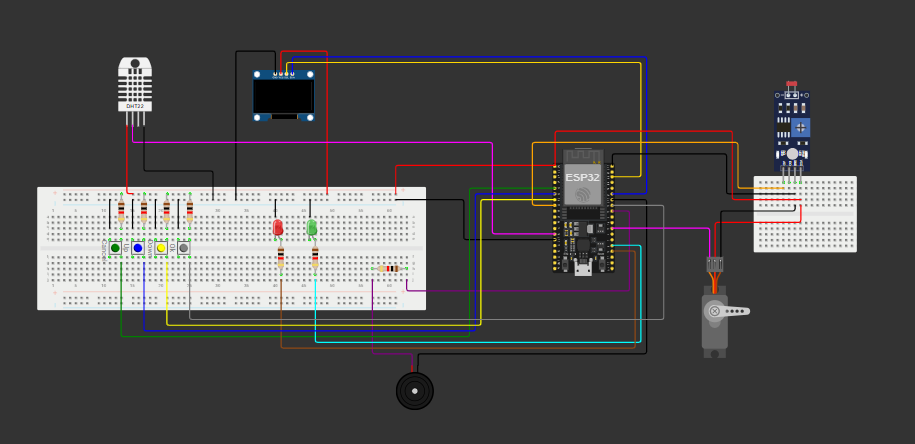

# Smart Medibox

A comprehensive, IoT-enabled smart medicine box designed to ensure medication is taken on time and stored in optimal environmental conditions. This system features a dual-alarm scheduler, environmental monitoring, and a remote dashboard for real-time data visualization and control.

---

## Features

-   **Environmental Monitoring**: Continuously tracks temperature and humidity using a DHT22 sensor to ensure medicines are stored safely.
-   **Visual & Audible Alerts**: Triggers a red LED and a buzzer if temperature or humidity levels go beyond the safe thresholds (24-32°C, 65-80% RH).
-   **Dual Alarm System**: Set up to two daily alarms for medication reminders.
-   **OLED Display Interface**: A 128x64 OLED screen displays the current time, environmental status, and a user-friendly menu.
-   **Interactive Menu**: Use push buttons (Up, Down, OK, Cancel) to:
    -   Set your local time zone.
    -   Configure and delete the two alarms.
    -   View active alarms.
-   **Snooze and Stop Functionality**: Snooze an active alarm for 5 minutes or stop it completely.
-   **Light-Controlled Servo**: A servo motor adjusts its position based on ambient light levels and other parameters, which can be used to control a lid or dispenser mechanism.
-   **Real-time IoT Dashboard**: A Node-RED dashboard visualizes live temperature, humidity, and light intensity data.
-   **Remote Control**: Adjust key system parameters like servo offset, control factors, and sampling intervals directly from the Node-RED dashboard via MQTT.

---

## Hardware Requirements

| Component           | Quantity | Purpose                                        |
| ------------------- | :------: | ---------------------------------------------- |
| ESP32 Dev Kit       |    1     | Main microcontroller                           |
| DHT22 Sensor        |    1     | Temperature and Humidity sensing               |
| SSD1306 OLED Display|    1     | User interface display (128x64, I2C)           |
| Active Buzzer       |    1     | Audible alarms and warnings                    |
| Servo Motor (SG90)  |    1     | Dispensing mechanism or lid control            |
| Push Buttons        |    4     | Menu navigation (UP, DOWN, OK, CANCEL)         |
| Red LED             |    1     | Environmental warning indicator                |
| Green LED           |    1     | Medication alarm indicator                     |
| LDR (Light Sensor)  |    1     | Ambient light sensing                          |
| Resistors           |  (var)   | Pull-up/pull-down for buttons and LDR          |
| Breadboard          |    1     | Prototyping circuit                            |
| Jumper Wires        |  (many)  | Connecting components                          |

---

## Wiring & Schematic

Connect the components to the ESP32 according to the pin definitions in the code.

| Component      | ESP32 Pin |
| -------------- | :-------: |
| DHT22 Sensor   |    12     |
| Red LED        |    15     |
| Green LED      |     2     |
| Buzzer         |    18     |
| Servo Motor    |    16     |
| LDR            |    33     |
| OK Button      |    19     |
| CANCEL Button  |    34     |
| UP Button      |    35     |
| DOWN Button    |    32     |
| **I2C for OLED** |           |
| OLED SDA       |    21     |
| OLED SCL       |    22     |


---

## Setup and Installation

### 1. ESP32 Firmware Setup (PlatformIO)

1.  **Install PlatformIO**: Follow the [official installation guide](https://platformio.org/install) to set up PlatformIO with VS Code.
2.  **Clone Repository**: Clone this project to your local machine.
3.  **Open Project**: Open the `Smart-Medibox` folder in VS Code. PlatformIO will automatically detect the `platformio.ini` file and prompt to install all required libraries. Click **Yes**.
4.  **Configure WiFi**: Open `src/Medibox.ino` and update the following lines with your WiFi credentials:
    ```cpp
    const char* ssid = "Wokwi-GUEST"; // Your WiFi SSID
    const char* password = "";        // Your WiFi Password
    ```
5.  **Build & Upload**: Connect your ESP32 to your computer, then use the PlatformIO controls to **Build** and **Upload** the firmware.

### 2. Node-RED Dashboard Setup

1.  **Install Node-RED**: If you don't have it, [install Node-RED](https://nodered.org/docs/getting-started/local).
2.  **Install Dashboard**: Open a terminal and run the following command to install the dashboard nodes:
    ```bash
    npm install node-red-dashboard
    ```
3.  **Run Node-RED**: Start Node-RED from your terminal:
    ```bash
    node-red
    ```
4.  **Import Flow**:
    -   Open your browser to `http://127.0.0.1:1880`.
    -   Click the hamburger menu (☰) in the top-right corner and select **Import**.
    -   Click **select a file to import** and choose the `nodered/flow.json` file from this project.
    -   Click **Import**.
5.  **Deploy**: Click the red **Deploy** button in the top-right corner.
6.  **View Dashboard**: Access the live dashboard by navigating to `http://127.0.0.1:1880/ui`.

---

## How It Works

### ESP32 Logic

The ESP32 is the brain of the Medibox. Its main loop continuously performs several key tasks:
-   **MQTT Connection**: It ensures a persistent connection to the `broker.emqx.io` MQTT broker to send sensor data and receive commands.
-   **Time & Alarms**: It fetches the current time from an NTP server and checks if the current time matches any of the user-set alarms. If an alarm triggers, it activates the buzzer and green LED.
-   **Environmental Checks**: It reads data from the DHT22 sensor. If values are outside the predefined safe range, it triggers a warning with the buzzer and red LED.
-   **Data Publishing**: It periodically publishes temperature, humidity, and averaged light intensity readings to the MQTT broker.
-   **Servo Control**: It calculates the appropriate servo angle based on a formula involving light intensity (`I`), temperature (`T`), and several control parameters (`ts`, `tu`, `gamma`, `theta_offset`, `Tmed`) that can be tuned from the Node-RED dashboard.
-   **User Input**: It listens for button presses to allow the user to enter the menu system to configure settings.

### Node-RED Flow

The Node-RED flow provides the visualization and remote-control layer:
-   **MQTT In Nodes**: These nodes subscribe to topics (`medibox/temperature`, `medibox/humidity`, `medibox/ldr`) to receive live data from the ESP32.
-   **UI Gauges & Charts**: The received data is immediately funneled into gauges and charts on the dashboard for real-time visualization.
-   **UI Sliders**: Sliders on the dashboard allow the user to change control parameters for the servo and sensor sampling.
-   **MQTT Out Nodes**: When a slider is adjusted, its value is published to a corresponding `medibox/nodeRed/...` topic. The ESP32 subscribes to these topics, receives the new value, and updates its internal variables instantly.

## Project Structure

```Smart-Medibox/
├── README.md          # You are here
├── platformio.ini     # PlatformIO config (libraries, board)
├── nodered/
│   └── flow.json      # Node-RED dashboard and logic flow
└── src/
    └── Medibox.ino    # Main ESP32 firmware source code
```
